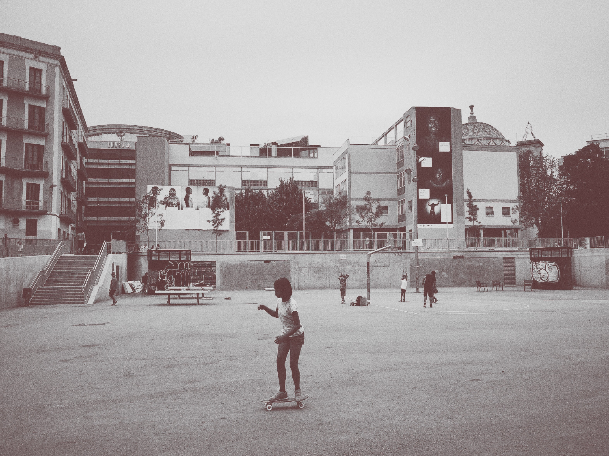



<main>

    

        

            <h2 class="header center-align ">Play more</h2>
            <h3 class="header center-align grey-text text-darken-2 ">De handige speel en schoolzoeker</h3>
            <h5 class="grey-text text-darken-2 center-align"> Zoek makkelijk een school en speelterrein aan de hand
                van een filter</h5>
        

        

            
<a href="/scholen/index.html" class="waves-effect waves-light btn">Scholen</a>
                <a href="/speelterreinen/index.html" class="waves-effect waves-light btn">Speelterreinen</a>

        

    

    

        

    

    

        

            <h3 class="header center-align grey-text text-darken-2 ">Updates</h3>
            <h5 class="grey-text text-darken-2 center-align">
                Als er nieuwe scholen zijn bij gekomen vind u dit hier. Alsook de speelterreinen.
            </h5>

            
<a class="waves-effect waves-light btn">Updates</a>

        

    

    

        

    

    

        

            <h4>Desing & Development</h4> 
            <h5>Mathias Van Sele & Jonatan Moerman</h5>
        

    

</main>